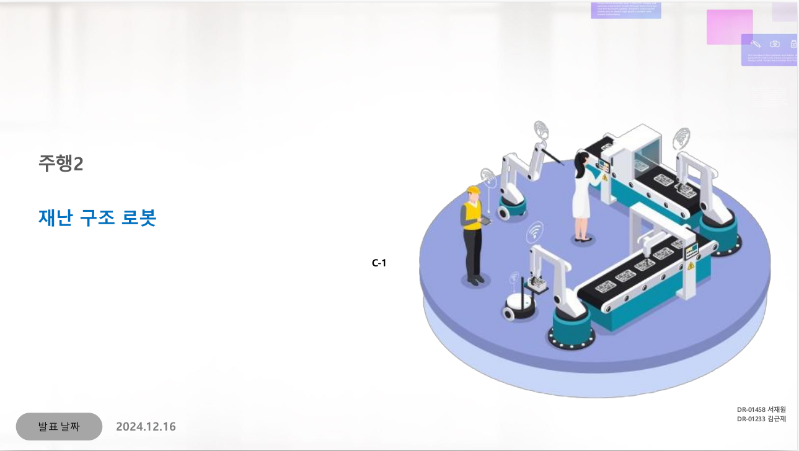
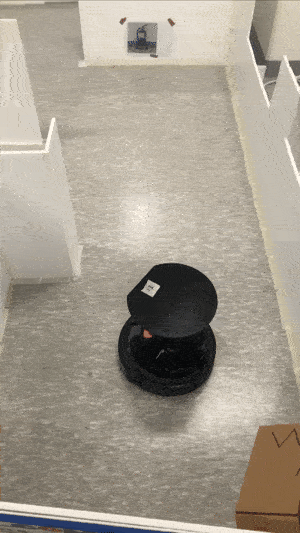
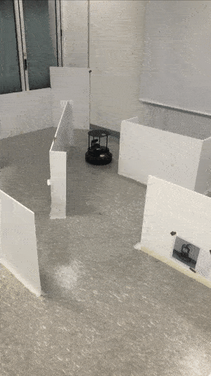
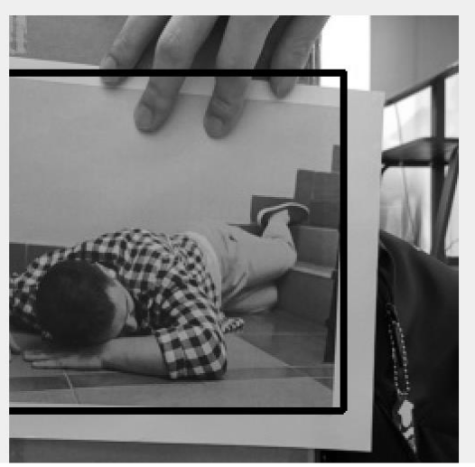
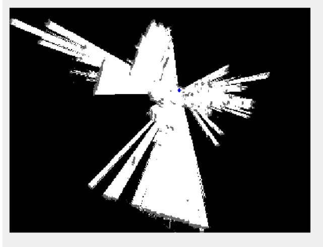
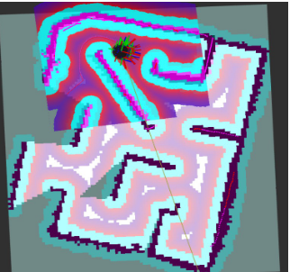

# 🤖 6주차: ROS2 기반 재난 구조 로봇 시스템

본 프로젝트는 **ROS2를 활용하여 재난 구조 로봇을 개발하고, Mapping, 탐색, 객체 탐지(Detection) 및 좌표 변환을 통한 맵 반영을 구현하는 것**을 목표로 합니다.

## 📜 발표 자료  

## 📌 프로젝트 개요
- **프로젝트명**: ROS2 기반 재난 구조 로봇 시스템
- **발표일**: 2024.12.16
- **팀명**: C-1조
- **팀원**: 서재원, 김근제

## 🎯 프로젝트 목표
- **ROS2를 활용한 자동화 탐색 및 구조 시스템 구축**
- **Mapping 알고리즘을 활용한 실시간 경로 탐색 및 목표지점 설정**
- **재난 환경에서의 로봇 주행 및 장애물 회피 알고리즘 구현**
- **객체 탐지(Detection) 및 좌표 변환을 통한 맵 반영 및 구조 대상 지정**

## ⚙️ 시스템 개요
### ✅ 주요 기능
- **맵 데이터 기반 자율 주행**
- **경로 탐색을 통한 목표 지점 자동 설정**
- **재난 환경에서 탐지 및 대응 기능**
- **객체 탐지(Detection)를 통한 실시간 인식 및 매칭 기능**
- **탐지된 객체의 위치를 맵 좌표로 변환 후 맵 반영**

### 📊 사용한 ROS2 기능
| No. | 기능명 | 설명 |
|----|---------|--------------------------------------------------|
| 1  | `map_callback` | 맵 데이터 수신 및 목표 지점 선정 |
| 2  | `pose_callback` | 로봇의 현재 위치 탐지 |
| 3  | `goal_publisher` | 목표 지점 좌표 발행 |
| 4  | `find_boundary` | 맵 데이터에서 경계점 찾기 |
| 5  | `find_goal` | 목표 지점을 설정하는 알고리즘 |
| 6  | `data_to_image` | 맵 데이터를 이미지 데이터로 변환 |
| 7  | `is_safe_goal` | 목표 지점 주변 장애물 확인 |
| 8  | `lidar_scan` | LiDAR를 활용한 장애물 감지 |
| 9  | `camera_stream` | 카메라 데이터를 활용한 탐색 기능 |
| 10 | `display_dashboard` | 관제 시스템에서 로봇 위치 및 경로 표시 |
| 11 | `detect_objects` | SIFT 기반 객체 탐지 및 매칭 수행 |
| 12 | `match_features` | 이미지 매칭 알고리즘을 사용하여 구조 대상 감지 |
| 13 | `pixel_to_scale` | 탐지된 객체의 픽셀 좌표를 실제 맵 좌표로 변환 |
| 14 | `pnp_and_tf` | PnP 알고리즘을 이용한 카메라-맵 좌표 변환 |
| 15 | `is_goal_safe` | 목표 위치가 안전한지 판단 후 이동 |

## 🏗️ 프로젝트 시나리오
### 1️⃣ 탐색 및 Mapping 알고리즘 적용
1. **로봇이 맵 데이터를 수집하고 이미지로 변환**
2. **경계선을 탐색하여 이동 가능한 구역 확인**
3. **목표 지점을 설정하여 로봇 이동 경로 생성**

### 2️⃣ 목표 지점 설정 및 자율 주행
1. **안전 영역 내 최적의 목표 지점 탐색**
2. **목표 지점으로 경로 계획 및 주행 시작**
3. **장애물 감지 시 회피 알고리즘 적용**

### 3️⃣ 객체 탐지 및 좌표 변환을 통한 구조 작업
1. **카메라 기반 SIFT 알고리즘으로 객체 탐지 수행**
2. **탐지된 객체와 템플릿 이미지를 비교하여 구조 대상 식별**
3. **픽셀 좌표를 실제 맵 좌표로 변환 (pixel_to_scale 사용)**
4. **PnP 알고리즘을 이용해 카메라-맵 좌표 변환 수행**
5. **맵 상에 탐지된 객체의 위치를 반영 후 구조 알고리즘 실행**

## 🔥 프로젝트 결과
### 📌 주요 코드 리뷰
#### 🏗️ 맵 데이터 처리 코드
- **맵 데이터를 이미지 데이터로 변환하여 분석**
- **경계선을 탐지하여 이동 가능한 공간을 설정**

#### 🏗️ 경로 탐색 및 목표 설정 코드
- **find_goal() 함수를 이용하여 목표 지점 설정**
- **목표 지점이 장애물 범위 내인지 확인 후 이동**

#### 🏗️ 장애물 회피 및 안전 경로 설정 코드
- **is_safe_goal() 함수를 사용하여 장애물 회피 알고리즘 구현**
- **장애물 회피 후 새로운 목표 지점 자동 설정**

#### 🏗️ 객체 탐지 및 매칭 코드
- **SIFT 알고리즘을 이용하여 구조 대상 객체 탐지**
- **match_features() 함수를 활용하여 템플릿과 비교 매칭**
- **탐지된 객체의 위치를 맵에 반영하여 구조 시나리오 수행**

#### 🏗️ 객체 좌표 변환 및 맵 반영 코드
- **pixel_to_scale()을 활용하여 탐지된 픽셀 좌표를 실제 맵 좌표로 변환**
- **pnp_and_tf()를 사용하여 3D-2D 변환을 수행하고 맵 상의 좌표 반영**
- **구조 대상을 맵에 추가하여 로봇이 접근 가능하도록 경로 설정**

### 🏆 실습 결과물
<table>
  <tr>
    <td align="center">
      
       <b>Good Autonomous Driving using map</b> 
    </td>
    <td align="center">
      
       <b>Bad Autonomous Driving using map</b> 
    </td>
  </tr>
  <tr>
    <td align="center">
      
       <b>Origin image</b> 
    </td>
    <td align="center">
      
       <b>Object Detection Using SIFT</b> 
    </td>
  </tr>
  <tr>
    <td align="center">
      
       <b>Pixel to Map Coordinate Transformation</b> 
    </td>
    <td align="center">
      
       <b>SLAM Map</b> 
    </td>
  </tr>
</table>

[Full 비디오 다운로드](https://github.com/sepengsu/rokey_week6_ws//raw/main/docs/final.mp4)
